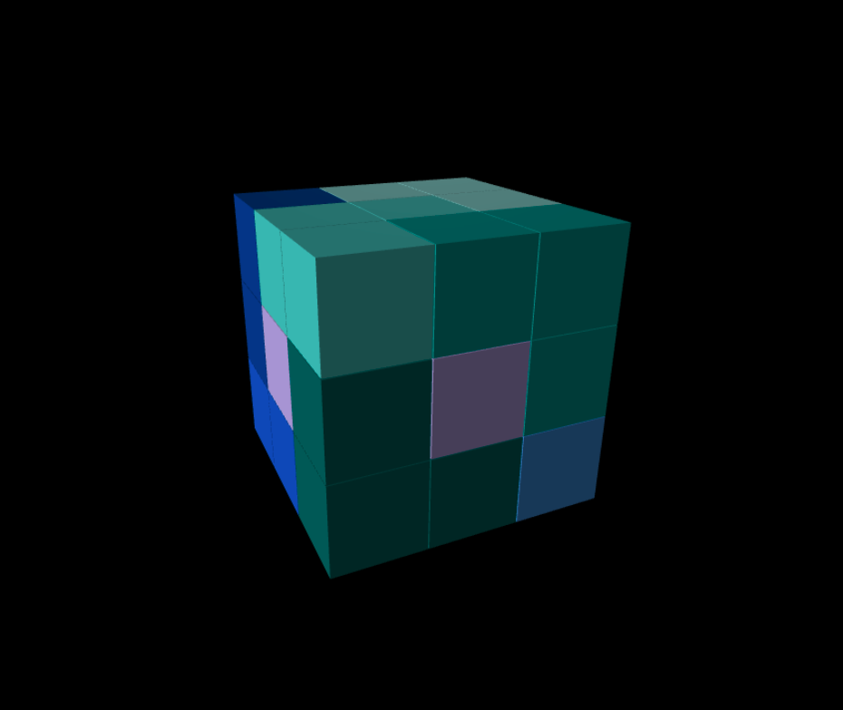
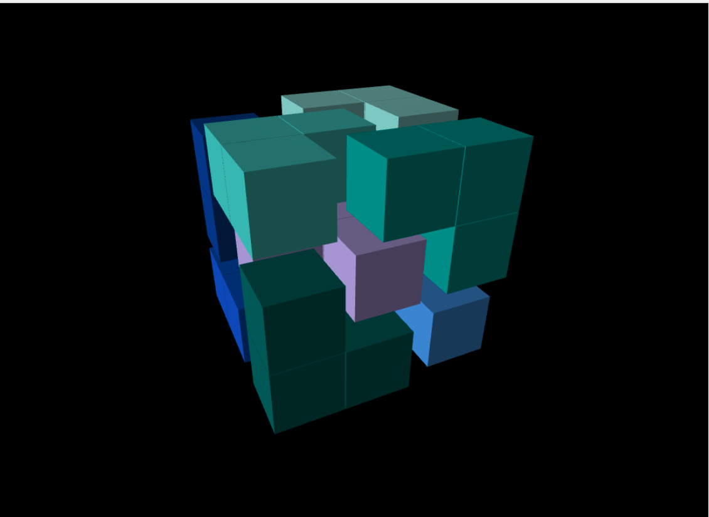
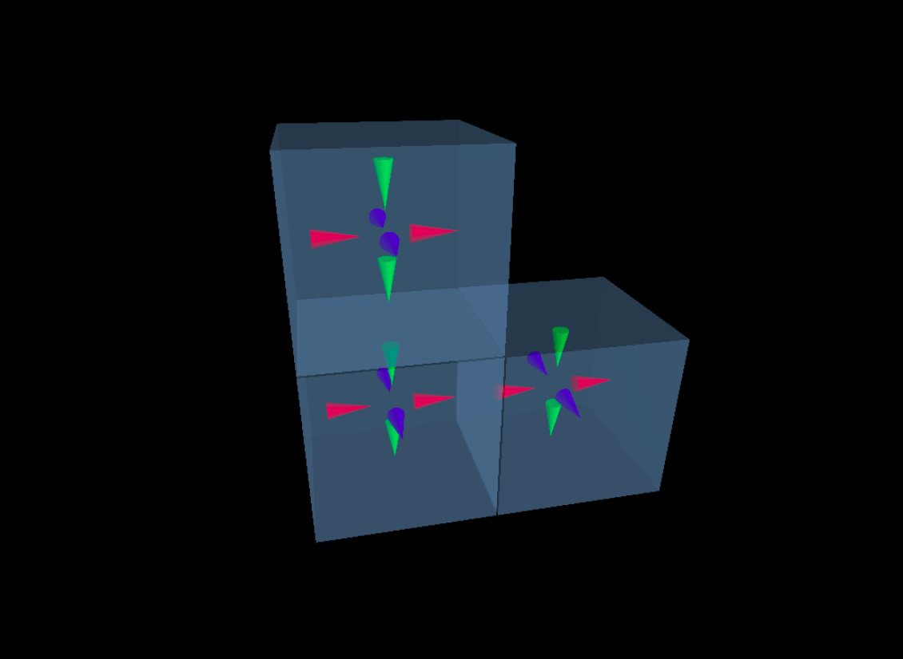

# Mag Cube

## Problem

This is my attempt at solving the purple magnetic cube puzzle in my mom's living room
using CP-SAT.  The puzzle consists of nine identical (I think!) pieces.  Each piece is
composed of three blocks, arranged in the shape of an L.  Each block face has magnetic
polarity, assumed to be the same for all blocks within a piece (also to be verified!).
The pieces must be fitted together in a magnetically compatible way to form a 3x3x3 cube.

Thus, the solved puzzle looks like this:

<p align="center">
  
</p>

Or, slightly exploded:

<p align="center">
  
</p>

And the individual pieces have magnetic polarity like this:

<p align="center">
  
</p>

## Solution(?)

My current model results in the following CP-SAT output:

```
CpSolverResponse summary:
status: INFEASIBLE
objective: NA
best_bound: NA
integers: 228
booleans: 255
conflicts: 4384
branches: 30696
propagations: 491460
integer_propagations: 377761
restarts: 2335
lp_iterations: 0
walltime: 0.684414
usertime: 0.684414
deterministic_time: 1.63148
gap_integral: 0

Status: 3 (INFEASIBLE)
```

This is actually consistent with my experience with the actual physical puzzle—I am able
to ostensibly assemble pieces to form the larger cube, but there always seems to be at
least one repulsive interaction between block faces somewhere.  The other magnetic forces,
as well as friction between faces (perpendicular to the offending surface), holds the
pieces together and makes the solution(?) appear valid (especially if I orient the flawed
area downward to bury, and/or let gravity suppress, the slight bulge), but I have never
solved it in a satisfactory way.

I am not mathematical enough to analytically determine whether a full solution is possible
(can someone help here?), so here are a few comments on where things currently stand:

1. The puzzle (as I assume the pieces to be, and as have encoded it) may be solvable, but
   I have not been able to find a solution, either physically or using the constraint
   solver model.

2. If it is solvable, then the constraint solver approach should work, therefore I have a
   bug in either my modeling of the problem, or my coding of it.  It is also possible
   there is a bug in CP-SAT, but that is far less likely.
   
3. It may also be that I am making some wrong assumptions about the pieces themselves
   (since I don't have access to the physical puzzle right now).  Either the magnetic
   polarities are different than I have assumed, or not all of the pieces are identical
   (which may actually be the trick of the puzzle!).  When I am back in Seattle, I will
   validate the pieces against my assumptions.

## To Do

1. Validate the puzzle pieces.

2. Find and fix modeling and/or coding problems (if any).

3. Convert the CP feasibility problem into an optimization problem, where the objective is
   to minimize the number of mismatched polarities between block faces.

## Acknowledgments

I want to recognize the following resources for their utility in this mini-project:

1. Google's [CP-SAT Solver](https://developers.google.com/optimization/cp/cp_solver)

2. Dominik Krupke's excellent [CP-SAT Primer](https://github.com/d-krupke/cpsat-primer)

3. The [VPython](https://glowscript.org/docs/VPythonDocs/index.html) library from Bruce
   Sherwood and David Scherer (and others), for the cool rendering capabilities
